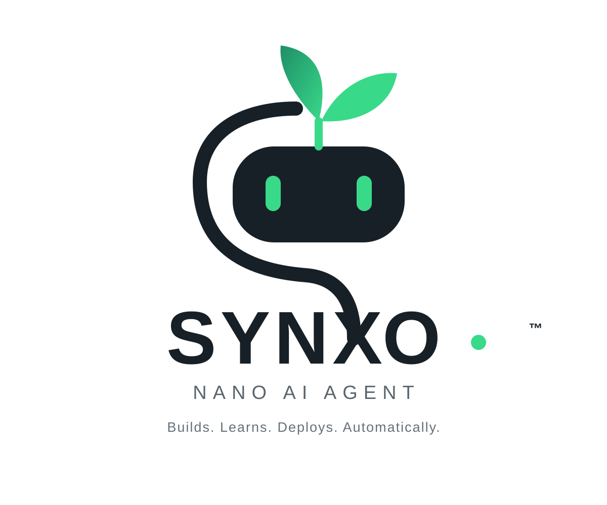

# SYNXO



**Nano AI Agent — Builds. Learns. Deploys. Automatically.**

SYNXO is a compact AI-agent platform concept focused on building and deploying small, efficient models for web applications and servers.

## What SYNXO is built to do

- Build small task-focused models.
- Prepare and manage training data.
- Train parameter-efficient adapters when suitable.
- Evaluate candidate model versions before deployment.
- Version models and retain reproducible build metadata.
- Deploy validated model versions to a website/server.
- Learn from approved feedback and new training examples through a controlled improvement loop.
- Reduce unnecessary inference, training, and context-token usage.

## Controlled improvement loop

```text
Approved data
     ↓
Dataset builder
     ↓
Training / adapter build
     ↓
Evaluation
     ↓
Better than current version?
   ↙             ↘
 NO              YES
 ↓                 ↓
Discard        Version + Deploy
                   ↓
                Website/API
```

SYNXO should not automatically modify its production model from every user interaction. Candidate changes should pass evaluation before promotion.

## Repository

```text
Synox-agent/
├── assets/
│   └── synxo-logo.svg
├── BRAND.md
└── README.md
```

## Brand

**SYNXO**

**Nano AI Agent**

**Builds. Learns. Deploys. Automatically.**

See [`BRAND.md`](BRAND.md) for the visual identity and product principles.
